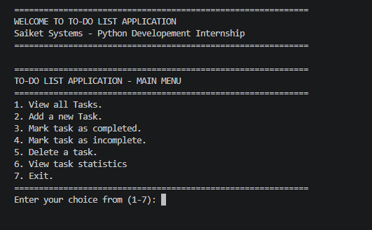
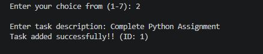
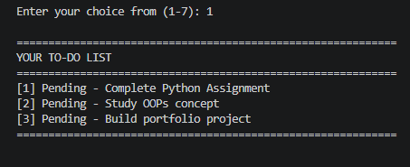
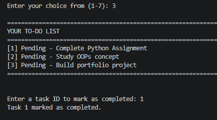
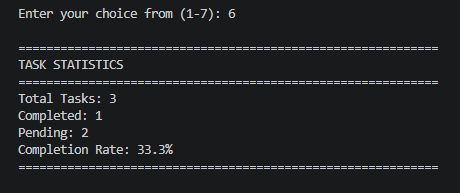

# To-Do List Application 📝

A Python CLI-based To-Do List Application built as **Task 1** for **Saiket Systems Python Development Internship**.


## 🎥 Demo

### Main Menu


### Adding Tasks


### View All Tasks


### Mark Task Complete


### Task Statistics


## Features ✨

✅ Add new tasks with descriptions
✅ View all tasks with status (Pending/Completed)
✅ Mark tasks as completed or incomplete
✅ Delete tasks
✅ View task statistics (total, completed, pending, completion rate)
✅ User-friendly interactive menu

## Technical Stack 💻

- **Language:** Python 3.x
- **Concepts:** Object-Oriented Programming, Data Structures, Exception Handling
- **Architecture:** Class-based design (Task & ToDoList classes)

## How to Run 🚀

```bash
python task_1_todo_list.py
```

## Usage 📖
1. View all Tasks
2. Add a new Task
3. Mark task as completed
4. Mark task as incomplete
5. Delete a task
6. View task statistics
7. Exit

## Learning Outcomes 🎓

- OOP principles with classes and encapsulation
- Dictionary-based data structures
- Exception handling and input validation
- Building interactive CLI applications
- Writing clean, maintainable code

## License 📄

MIT License

---

Built with ❤️ during Saiket Systems Internship